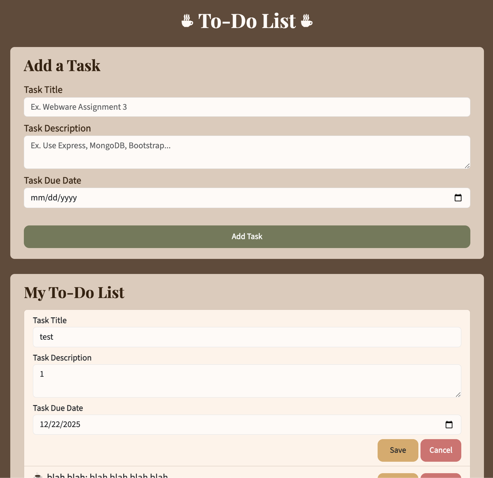

Assignment 3 - Persistence: Two-tier Web Application with Database, Express server, and CSS template
===
Arianna Xie

Render link: https://a3-ariannaxie.onrender.com

## Coffee-Themed To-Do List
AI Usage Note: I used ChatGPT to learn and become familar with Express and MongoDB API. I asked it to give me examples of functions I read from Express documentation like res.sendFile() or to explain functions like express.json(). I also asked it to explain MongoDB functions like findOneAndUpdate() vs updateOne() or res.params.id vs res.params._id.

### To run (locally): 
node --env-file=.env server.js

### Logging In Instructions:
1. From log in page, click "Auth0 Log In"
2. Click the GitHub option
3. Follow the prompted instructions

### Goal
The goal of my application is a coffee-themed to-do list where users can log in, add, delete, and edit tasks. The tasks are stored in a database that the server is connected to.

### Challenges
1. I had some minor struggles with connecting my server to the database. I realized I needed to connect my .env file using the run command stated above.
2. It was a learning curve getting used to Express and MongoDB and their APIs. I had to Google and ask ChatGPT about concepts like req.params, Object ids, or res.sendFile() to learn how to use them.
3. As I was refactoring my code from a2, I spent a lot of my time debugging, solving bugs ranging from the date displaying in a different timezone to the edit form not saving.
4. When it came to styling, I had to Google how to install and use Bootstrap. I frequently referenced the Bootstrap documentation.
5. I had to refer to Auth0 and Passport documentation to implement Auth0 into my application. I also had to Google how to add GitHub as an option for Auth0 sign in.
7. I had some trouble adding client IDs and Secrets to the Auth0 connections, but I was able to figure it out with the help of Google.
6. When deploying my app to Render, I had to change the callback routes.

### Authentication Strategy
- I chose to use Auth0 because it was mentioned in the assignment instructions and I had used it for Software Engineering.

### CSS Framework
  - I used Bootstrap because I was looking through its docs and it had a lot of components I thought would be useful.
  Modifications:
  - I defined my own font and button colors
  - I also changed the background color of the form-control class to have it match my theme

### Express Middleware Packages
- a list of Express middleware packages you used and a short (one sentence) summary of what each one does. If you use a custom function, please add a little more detail about what it does.
- express.json(): parses JSON data and stores parsed object in req.body
- express.static("public"): serves static files from the "public" folder
- middleware_db_check: checks to make sure database is connected
- ensureAuthenticated: ensures the user is authenticated (logged in)
- app.get("/tasks", ...): gets all the tasks from the database
- app.get("/task/:id", ...): get the task with the parameter id
- app.post("/add", ...): gets the task-related information from the client-side add form, calculates the daysUntilDue, adds daysUntilDue to the new task, and inserts the new task into the database
- app.put("/update/:id", ...): gets the task-related information from the client-side edit form, recalculates the daysUntilDue, finds the task with the parameter id, updates the information in the database, and sends the updated task to the front-end
- app.delete("/delete/:id", ...): deletes the task with the parameter id from the database

## Technical Achievements
- **Tech Achievement 1**: I used Auth0 authentication via the Passport strategy

- **Tech Achievement 2**: I received a score of 100 on my Lighthouse Test

### Design/Evaluation Achievements

- **Design Achievement 1**: I followed the following tips from the W3C Web Accessibility Initiative...
1. Provide informative, unique page titles: I named my pages Coffee To-Do List and Sign In

2. Use headings to convey meaning and structure: I made the heading "To-Do List" and subheadings "Add a Task" and "My To-Do List"
3. Write code that adapts to the user’s technology: I made the page responsive to page resizing

4. Keep content clear and concise: I made the form labels clear and concise
5. Provide sufficient contrast between foreground and background: I made sure there is contrast between the page color, sections color, list items color, buttons, and text.
6. Don’t use color alone to convey information: I put labels on the red buttons like Delete and Cancel
7. Ensure that interactive elements are easy to identify: I added colors to the buttons to make them stand out. I also made the form elements a different color from the background to have them stand out.
8. Ensure that form elements include clearly associated labels: I added labels to the form elements.
9. Use headings and spacing to group related content: I used spacing and headings to group the "add new task" section and the "task-list" section.
10. Create designs for different viewport sizes: I reformated the form layout depending on the screen size.
11. Reflect the reading order in the code order: In my html file, I made sure that the order of the elements made sense (putting the headings first, then the "add a task" form, then the task list, etc).
12. Help users avoid and correct mistakes: I added validation messages to the date field, to tell users that they can't add a date that's in the past.

- **Design Achievement 2**: CRAP Design Principles
Which element received the most emphasis (contrast) on each page? How did you use proximity to organize the visual information on your page? What design elements (colors, fonts, layouts, etc.) did you use repeatedly throughout your site? How did you use alignment to organize information and/or increase contrast for particular elements. Write a paragraph of at least 125 words *for each of four principles* (four paragraphs, 500 words in total).

***Contrast***
In my application, I used contrast in the colors and fonts. I wanted to make my application coffee-themed, so I wanted to stick with a color palette that fit the theme. Initially, I decided to go with browns and creams, but I wanted to add more color, so I added fall colors like yellow, green, and red as accent colors. To add more contrast to the application, I made the page color dark brown and the sections that sit on the page a lighter brown. Furthermore, I used the accent colors for the buttons to add even more contrast to the page and help them stick out. Besides the colors, I also added contrast to the fonts. I used a serif font for the headings and a sans serif font for the body content. I also made the font-size larger for the heading and subheadings to establish a visual hierarchy that way. To make the "log out" button stand out, I made the button color white.

***Repetition***
For repetition, I used the same colors, fonts, and layouts throughout my application. I stuck to a color palette and a color for the sections' background, form elements, and task list. I also used the same color palette for the Auth0 Log In. Besides the colors, I also used the same fonts repeatedly. I used a serif font for the headings and a sans serif font for the body content and task items. Lastly, I used repetition in the layout. I made each of the form elements similar in style, and matched the layout of the "add a task" form to the layout of the "edit a task" form. In addition to the repetition in the form elements, I used repetition for the layout of each task. For each task, the layout is the same, even if they don't include pieces of information like the description. Lastly, I included repetition in the button layouts. The "edit" and "delete" button layout is the same as the "save" and "cancel" buttons.

***Alignment***
For alignment, I used it to organize and increase contrast by the content by centering the heading and left-aligning the subheadings to make the heading stand out more. I also right-aligned the buttons inside the tasks (like the "edit," "delete," "save," and "cancel" buttons) and centered the text inside them to ensure that they would be aligned no matter the length of the text inside the task. In addition to this, I aligned the left side of the tasks (like the title/description row and the due-date/days-until-due row) to ensure they started on the same vertical line as each other. I also aligned the coffee bullet points and made sure that all the task text fell after the bullet point using alignment. On the Log In page, I aligned everything to have them all be centered on the page, so it would look uniform with the Auth0 Log In page.

***Proximity***
Lastly, I used proximity to group the sections in my application and orgnaize the content on my page. I placed all the "Add a Task" items together to group those under a section and I placed all the "My To-Do List" items together to group them, creating a visual distinction between the two sections. Within the "Add a Task" section, I placed the form elements close together to group the form. Within the "My To-Do List" section, I placed the tasks close to each other to group the task list. Furthermore, I placed the task text together and the task action buttons (like the "edit" and "delete"buttons) together to create a distinction between the two. On the Log In page, I grouped the log-in heading and button together to distiguish them from the overall application heading/title.