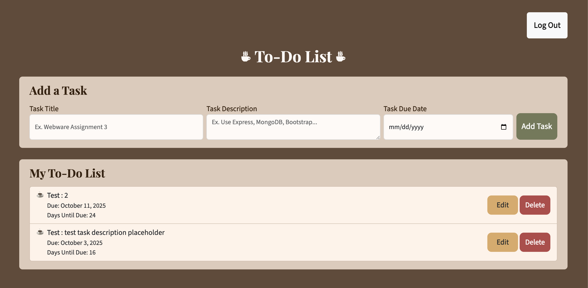

Assignment 3 - Persistence: Two-tier Web Application with Database, Express server, and CSS template
===

Check out the [CS 4241 Guides](https://github.com/jmcuneo/cs4241-guides) for help with the technologies discussed in this assignment.

This assignnment continues where we left off, extending it to use the most popular Node.js server framework (express), 
a database (mongodb), and a CSS application framework / template of your choice (Boostrap, Material Design, Semantic UI, Pure etc.)

Baseline Requirements
---

Your application is required to implement the following functionalities:

- (15 points) a `Server`, created using Express (no alternatives will be accepted for this assignment)
- (10 points) a `Results` functionality which shows all data associated with a logged in user (except passwords)
- (15 points) a `Form/Entry` functionality which allows users to add, modify, and delete data items (must be all three!) associated with their user name / account.
- Persistent data storage in between server sessions using [mongodb](https://www.mongodb.com/cloud/atlas) (you *must* use mongodb for this assignment). You can use either the [official mongodb node.js library](https://www.npmjs.com/package/mongodb) or use the [Mongoose library](https://www.npmjs.com/package/mongoose), which enables you to define formal schemas for your database. Please be aware that the course staff cannot provide in-depth support for use of Mongoose.  (15 pts.)
- (10 points) Use of a [CSS framework or template](https://github.com/troxler/awesome-css-frameworks). This should do the bulk of your styling/CSS for you and be appropriate to your application. For example, don't use [NES.css](https://nostalgic-css.github.io/NES.css/) (which is awesome!) unless you're creating a game or some type of retro 80s site.

Your application is required to demonstrate the use of the following concepts:  

HTML:  
- (5 points) HTML input tags and form fields of various flavors (`<textarea>`, `<input>`, checkboxes, radio buttons, etc.)
- HTML that can display all data *for a particular authenticated user*. Note that this is different from the last assignnment, which required the display of all data in memory on the server.

Note that it might make sense to have two pages for this assignment, one that handles login / authentication and one that contains the rest of your application. For example, when visiting the home page for the assignment, users could be presented with a login form. After submitting the login form, if the login is successful, they are taken to the main application. If they fail, they are sent back to the login to try again. For this assignment, it is acceptable to simply create new user accounts upon login if none exist; however, you must alert your users to this fact.  

CSS:  
- CSS styling should primarily be provided by your chosen template/framework. Oftentimes a great deal of care has been put into designing CSS templates; don't override their stylesheets unless you are extremely confident in your graphic design capabilities. The idea is to use CSS templates that give you a professional-looking design aesthetic without requiring you to be a graphic designer yourself.

JavaScript:  
- At minimum, a small amount of front-end JavaScript to get / fetch data from the server. See the [previous assignment](https://github.com/jmcuneo/a2-shortstack-a25) for reference.

Node.js:  
- A server using Express and a persistent database (mongodb).

General:  
- (10 points) Your site should achieve at least 90% on the `Performance`, `Best Practices`, `Accessibility`, and `SEO` tests using Google [Lighthouse](https://developers.google.com/web/tools/lighthouse) (don't worry about the PWA test, and don't worry about scores for mobile devices). Test early and often so that fixing problems doesn't lead to suffering at the end of the assignment. 

Deliverables
---

Do the following to complete this assignment:

1. Implement your project with the above requirements. I'd begin by converting your A2 assignment. First, change the server to use express. Then, modify the server to use mongodb instead of storing data locally. Last but not least, implement user accounts and login. User accounts and login is often the hardest part of this assignment, so budget your time accordingly.
2. If you developed your project locally, deploy your project to Render (unless completing the alternative server technical acheivement described below), and fill in the appropriate fields in your package.json file.
3. Test your project to make sure that when someone goes to your main page on Render (or an alternative server), it displays correctly.
4. Ensure that your project has the proper naming scheme `a3-FirstnameLastname` so we can find it.
5. Fork this repository and modify the README to the specifications below.
6. Create and submit a Pull Request to the original repo. Name the pull request using the following template: `a3-FirstnameLastname`.

Acheivements
---

Below are suggested technical and design achievements. You can use these to help boost your grade up to an A and customize the assignment to your personal interests, for a maximum twenty additional points and a maximum grade of a 100%. These are recommended acheivements, but feel free to create/implement your own... just make sure you thoroughly describe what you did in your README, why it was challenging, and how many points you think the achievement should be worth. ALL ACHIEVEMENTS MUST BE DESCRIBED IN YOUR README IN ORDER TO GET CREDIT FOR THEM.

*Technical*
- (10 points) Implement OAuth authentication, perhaps with a library like [passport.js](http://www.passportjs.org/). *You must either use Github authenticaion or provide a username/password to access a dummy account*. Course staff cannot be expected, for example, to have a personal Facebook, Google, or Twitter account to use when grading this assignment. Please contact the course staff if you have any questions about this. THIS IS THE HARDEST ACHEIVEMENT OFFERED IN WEBWARE. You have been warned!  
- (5 points) Instead of Render, host your site on a different service. Find a service that is reputable and has a free tier. Post your findings on Slack in the #assignment3 channel. DO NOT feel compelled to purchase a paid tier from any service, although if you already have one, you are welcome to use it. Make sure to describe this a bit in your README. What was better about using the service you chose as compared to Render? What (if anything) was worse? 
- (5 points) Get 100% (not 98%, not 99%, but 100%) in all four lighthouse tests required for this assignment.  

*Design/UX*
- (10 points) Make your site accessible using the [resources and hints available from the W3C](https://www.w3.org/WAI/). Implement/follow twelve tips from their [tips for writing](https://www.w3.org/WAI/tips/writing/), [tips for designing](https://www.w3.org/WAI/tips/designing/), and [tips for development](https://www.w3.org/WAI/tips/developing/). *Note that all twelve must require active work on your part*. For example, even though your page will most likely not have a captcha, you don't get this as one of your twelve tips to follow because you're effectively 
getting it "for free" without having to actively change anything about your site. Contact the course staff if you have any questions about what qualifies and doesn't qualify in this regard.
List each tip that you followed and describe what you did to follow it in your site.
- (5 points) Describe how your site uses the CRAP principles in the Non-Designer's Design Book readings. Which element received the most emphasis (contrast) on each page? How did you use proximity to organize the visual information on your page? What design elements (colors, fonts, layouts, etc.) did you use repeatedly throughout your site? How did you use alignment to organize information and/or increase contrast for particular elements. Write a paragraph of at least 125 words *for each of four principles* (four paragraphs, 500 words in total). 

FAQ
---
**Q: Am I required modify my A2 submission for this assignment?**

No. If you want to start fresh for A3, you are welcome to do so. The option to start with A2 is simply there as a convenience for you.

**Q: Which CSS framework should I use? How do I use it?**

This is for you to figure out. While we do require Express and MongoDB for this assignment, we do not require a specific CSS framework, so we are not going to be discussing a specific one. You will be responsible for choosing a CSS framework and learning how to use it.

**Q: How do I keep my .env file out of my git repo?**

Create a .gitignore file on your local machine and list your .env file in it. Note that while your .env file should NOT appear in your repo, you will still want to [add it to your Render project](https://render.com/docs/configure-environment-variables) so that your website runs successfully.

**Q: I'm confused about how user accounts work for this assignment.**

For the base requirements (discounting the achievements), it should follow this logic:

1. If the user logs in and the account does not exist, create the account and inform the user the account has been created.
2. If the user logs in and the account exists but the password is incorrect, inform the user.
3. If the user logs in, the account exists, and the password is correct, then take the user to the page that shows the data specific to the user.

Note that implementing some of the technical achievements may override this requirement, which is fine.

**Q: I'm getting a syntax error when trying to connect to MongoDB using the code in the tutorial.**

Your version of Node may be outdated. Check out [this link](https://stackoverflow.com/questions/77749884/session-options-session-syntaxerror-unexpected-token-mongoose-give-a) for more information.

**Q: Do I have to handle multiple user accounts?**

No. You only need one dummy account UNLESS you are doing the GitHub login technical achievement. Make sure you mention in your README how the user should log in!

**Q: If we use OAuth for logging in, do we still need the same pattern of behavior from the website when logging in (as described above)?**

Yes, insofar as the logged in user should still be taken to a page with the user's data, the login should fail for the incorrect password, and a new account should be created if the username is unrecognized.

Note that if you are doing OAuth, this last part might be difficult (especially if you are doing GitHub authentication). If that's the case, then the user should be taken to a page where they can create an account for your site.

**Q: Does "HTML input tags and form fields of various flavors" mean that we need to use multiple different kinds of inputs, or does it mean that we just need to use some form of input?**

You should have at least two different input types for this assignment. The purpose is to show your understanding beyond the simple `input` type you saw in A2.

**Q: Am I allowed to use other libraries/frameworks/etc. in this assignment?**

Yes, so long as those are IN ADDITION TO Express, MongoDB, and a CSS framework of your choice. Describe in your README any additional libraries or frameworks you used for this assignment. Also remember that the staff might not be familiar with these, so we may be unable to help you if you run into technical problems.

Sample Readme (delete the above when you're ready to submit, and modify the below so with your links and descriptions)
---

## Coffee-Themed To-Do List
AI Usage Note: I used ChatGPT to learn and become familar with Express and MongoDB API. I asked it to give me examples of functions I read from Express documentation like res.sendFile() or to explain functions like express.json(). I also asked it to explain MongoDB functions like findOneAndUpdate() vs updateOne() or res.params.id vs res.params._id.

Your Render (or alternative server) link e.g. http://a3-joshua-cuneo.render.me

### To run: 
node --env-file=.env server.js
or 
npm start

Include a very brief summary of your project here. Images are encouraged, along with concise, high-level text. Be sure to include:
### Goal
The goal of my application is a coffee-themed to-do list where users can log in, add, delete, and edit tasks. The tasks are stored in a database that the server is connected to.

### Challenges
1. I had some minor struggles with connecting my server to the database. I realized I needed to connect my .env file using the run command stated above.
2. It was a learning curve getting used to Express and MongoDB and their APIs. I had to Google and ask ChatGPT about concepts like req.params, Object ids, or res.sendFile() to learn how to use them.
3. As I was refactoring my code from a2, I spent a lot of my time debugging, solving bugs ranging from the date displaying in a different timezone to the edit form not saving.
4. When it came to styling, I had to Google how to install and use Bootstrap. I frequently referenced the Bootstrap documentation.
5. I had to refer to Auth0 and Passport documentation to implement Auth0 into my application. I also had to Google how to add GitHub as an option for Auth0 sign in.
6. When deploying my app to Railway, it kept crashing, and I realized it was because I had defined a start script for "node --env-file=.env server.js" and I had to take out the .env.

### Authentication Strategy
- I chose to use Auth0 because it was mentioned in the assignment instructions and I had used it for Software Engineering.

### CSS Framework
  - I used Bootstrap because I was looking through its docs and it had a lot of components I thought would be useful.
  Modifications:
  - I defined my own font and button colors
  - I also changed the background color of the form-control class to have it match my theme

### Express Middleware Packages
- a list of Express middleware packages you used and a short (one sentence) summary of what each one does. If you use a custom function, please add a little more detail about what it does.
- express.json(): parses JSON data and stores parsed object in req.body
- express.static("public"): serves static files from the "public" folder
- middleware_db_check: checks to make sure database is connected
- ensureAuthenticated: ensures the user is authenticated (logged in)
- app.get("/tasks", ...): gets all the tasks from the database
- app.get("/task/:id", ...): get the task with the parameter id
- app.post("/add", ...): gets the task-related information from the client-side add form, calculates the daysUntilDue, adds daysUntilDue to the new task, and inserts the new task into the database
- app.put("/update/:id", ...): gets the task-related information from the client-side edit form, recalculates the daysUntilDue, finds the task with the parameter id, updates the information in the database, and sends the updated task to the front-end
- app.delete("/delete/:id", ...): deletes the task with the parameter id from the database

## Technical Achievements
- **Tech Achievement 1**: I used Auth0 authentication via the Passport strategy

- **Tech Achievement 2**: 

- **Tech Achievement 3**: I received a score of on my Lighthouse Test

### Design/Evaluation Achievements

- **Design Achievement 1**: I followed the following tips from the W3C Web Accessibility Initiative...
1. Provide informative, unique page titles: I named my pages Coffee To-Do List and Sign In

2. Use headings to convey meaning and structure: I made the heading "To-Do List" and subheadings "Add a Task" and "My To-Do List"
3. Write code that adapts to the user’s technology: I made the page responsive to page resizing

4. Keep content clear and concise: I made the form labels clear and concise
5. Provide sufficient contrast between foreground and background: I made sure there is contrast between the page color, sections color, list items color, buttons, and text.
6. Don’t use color alone to convey information: I put labels on the red buttons like Delete and Cancel
7. Ensure that interactive elements are easy to identify: I added colors to the buttons to make them stand out. I also made the form elements a different color from the background to have them stand out.
8. Ensure that form elements include clearly associated labels: I added labels to the form elements.
9. Use headings and spacing to group related content: I used spacing and headings to group the "add new task" section and the "task-list" section.
10. Create designs for different viewport sizes: I reformated the form layout depending on the screen size.
11. Reflect the reading order in the code order: In my html file, I made sure that the order of the elements made sense (putting the headings first, then the "add a task" form, then the task list, etc).
12. Help users avoid and correct mistakes: I added validation messages to the date field, to tell users that they can't add a date that's in the past.

- **CRAP Design Principles**
Which element received the most emphasis (contrast) on each page? How did you use proximity to organize the visual information on your page? What design elements (colors, fonts, layouts, etc.) did you use repeatedly throughout your site? How did you use alignment to organize information and/or increase contrast for particular elements. Write a paragraph of at least 125 words *for each of four principles* (four paragraphs, 500 words in total).

***Contrast***
In my application, I used contrast in the colors and fonts. I wanted to make my application coffee-themed, so I wanted to stick with a color palette that fit the theme. Initially, I decided to go with browns and creams, but I wanted to add more color, so I added fall colors like yellow, green, and red as accent colors. To add more contrast to the application, I made the page color dark brown and the sections that sit on the page a lighter brown. Furthermore, I used the accent colors for the buttons to add even more contrast to the page and help them stick out. Besides the colors, I also added contrast to the fonts. I used a serif font for the headings and a sans serif font for the body content. I also made the font-size larger for the heading and subheadings to establish a visual hierarchy that way. To make the "log out" button stand out, I made the button color white.
***Repetition***
For repetition, I used the same colors, fonts, and layouts throughout my application. I stuck to a color palette and a color for the sections' background, form elements, and task list. I also used the same color palette for the Auth0 Log In. Besides the colors, I also used the same fonts repeatedly. I used a serif font for the headings and a sans serif font for the body content and task items. Lastly, I used repetition in the layout. I made each of the form elements similar in style, and matched the layout of the "add a task" form to the layout of the "edit a task" form. In addition to the repetition in the form elements, I used repetition for the layout of each task. For each task, the layout is the same, even if they don't include pieces of information like the description. Lastly, I included repetition in the button layouts. The "edit" and "delete" button layout is the same as the "save" and "cancel" buttons.
***Alignment***
For alignment, I used it to organize and increase contrast by the content by centering the heading and left-aligning the subheadings to make the heading stand out more. I also right-aligned the buttons inside the tasks (like the "edit," "delete," "save," and "cancel" buttons) and centered the text inside them to ensure that they would be aligned no matter the length of the text inside the task. In addition to this, I aligned the left side of the tasks (like the title/description row and the due-date/days-until-due row) to ensure they started on the same vertical line as each other. I also aligned the coffee bullet points and made sure that all the task text fell after the bullet point using alignment. On the Log In page, I aligned everything to have them all be centered on the page, so it would look uniform with the Auth0 Log In page.
***Proximity***
Lastly, I used proximity to group the sections in my application and orgnaize the content on my page. I placed all the "Add a Task" items together to group those under a section and I placed all the "My To-Do List" items together to group them, creating a visual distinction between the two sections. Within the "Add a Task" section, I placed the form elements close together to group the form. Within the "My To-Do List" section, I placed the tasks close to each other to group the task list. Furthermore, I placed the task text together and the task action buttons (like the "edit" and "delete"buttons) together to create a distinction between the two. On the Log In page, I grouped the log-in heading and button together to distiguish them from the overall application heading/title.